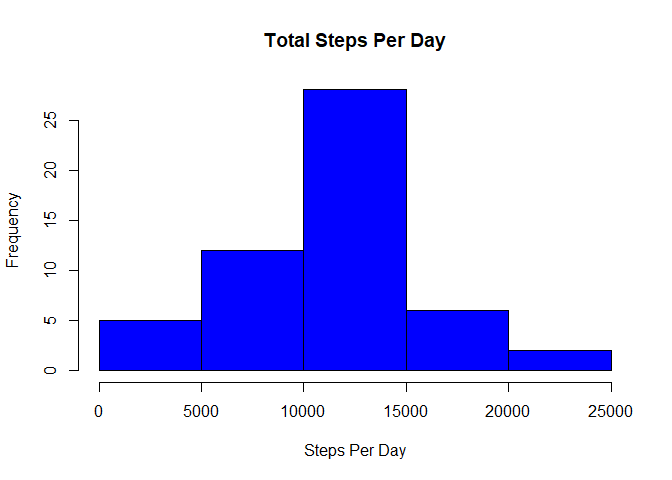
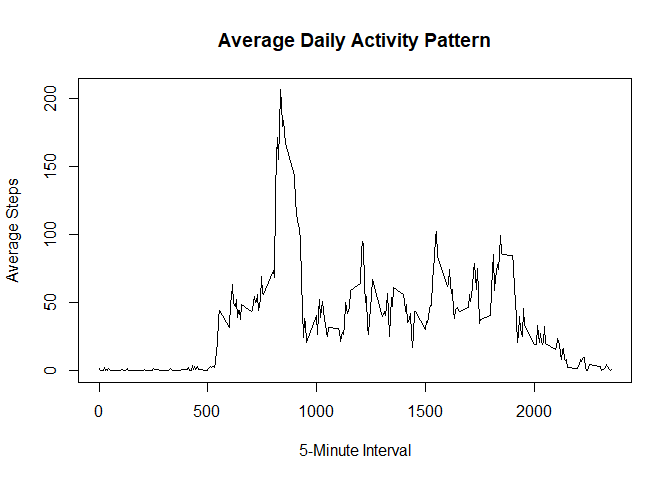
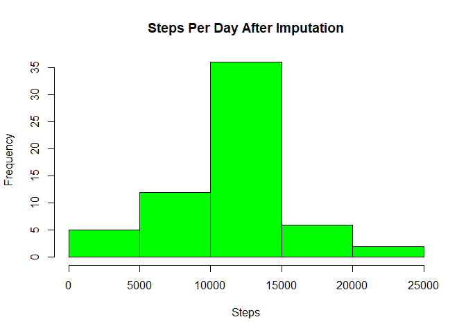
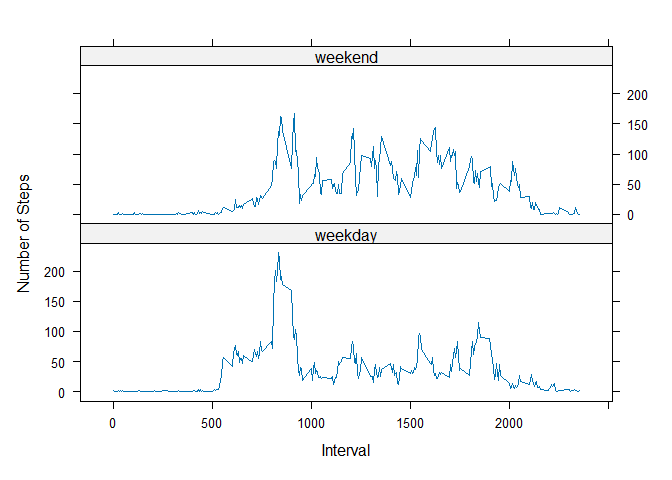

## Loading and preprocessing the data

``` r
data <- read.csv("activity.csv")
head(data)
```

```
##   steps       date interval
## 1    NA 2012-10-01        0
## 2    NA 2012-10-01        5
## 3    NA 2012-10-01       10
## 4    NA 2012-10-01       15
## 5    NA 2012-10-01       20
## 6    NA 2012-10-01       25
```


``` r
data$date <- as.Date(data$date)
str(data)
```

```
## 'data.frame':	17568 obs. of  3 variables:
##  $ steps   : int  NA NA NA NA NA NA NA NA NA NA ...
##  $ date    : Date, format: "2012-10-01" "2012-10-01" ...
##  $ interval: int  0 5 10 15 20 25 30 35 40 45 ...
```
## What is mean total number of steps taken per day?

``` r
steps_per_day <- aggregate(steps ~ date, data, sum, na.rm=TRUE)
head(steps_per_day)
```

```
##         date steps
## 1 2012-10-02   126
## 2 2012-10-03 11352
## 3 2012-10-04 12116
## 4 2012-10-05 13294
## 5 2012-10-06 15420
## 6 2012-10-07 11015
```


``` r
hist(steps_per_day$steps,
     main="Total Steps Per Day",
     xlab="Steps Per Day",
     col="blue")
```

<!-- -->


``` r
mean_steps <- mean(steps_per_day$steps)
median_steps <- median(steps_per_day$steps)

mean_steps
```

```
## [1] 10766.19
```

``` r
median_steps
```

```
## [1] 10765
```


## What is the average daily activity pattern?


``` r
interval_avg <- aggregate(steps ~ interval, data, mean, na.rm=TRUE)
head(interval_avg)
```

```
##   interval     steps
## 1        0 1.7169811
## 2        5 0.3396226
## 3       10 0.1320755
## 4       15 0.1509434
## 5       20 0.0754717
## 6       25 2.0943396
```


``` r
plot(interval_avg$interval,
     interval_avg$steps,
     type="l",
     xlab="5-Minute Interval",
     ylab="Average Steps",
     main="Average Daily Activity Pattern")
```

<!-- -->


``` r
max_interval <- interval_avg[which.max(interval_avg$steps), ]
max_interval
```

```
##     interval    steps
## 104      835 206.1698
```

## Imputing missing values


``` r
missing_values <- sum(is.na(data$steps))
missing_values
```

```
## [1] 2304
```


``` r
interval_means <- aggregate(steps ~ interval, data, mean, na.rm=TRUE)
```


``` r
filled_data <- data

for(i in 1:nrow(filled_data)) {
  if(is.na(filled_data$steps[i])) {
    
    interval_value <- filled_data$interval[i]
    
    replacement <- interval_means$steps[
      interval_means$interval == interval_value
    ]
    
    filled_data$steps[i] <- replacement
  }
}
```


``` r
filled_steps_day <- aggregate(steps ~ date,
                              filled_data,
                              sum)
```


``` r
hist(filled_steps_day$steps,
     main="Steps Per Day After Imputation",
     xlab="Steps",
     col="green")
```

<!-- -->


``` r
mean_filled <- mean(filled_steps_day$steps)
median_filled <- median(filled_steps_day$steps)

mean_filled
```

```
## [1] 10766.19
```

``` r
median_filled
```

```
## [1] 10766.19
```
## Are there differences in activity patterns between weekdays and weekends?

``` r
filled_data$day_type <- ifelse(
  weekdays(filled_data$date) %in% c("Saturday", "Sunday"),
  "weekend",
  "weekday"
)

filled_data$day_type <- as.factor(filled_data$day_type)
```


``` r
weekday_weekend <- aggregate(
  steps ~ interval + day_type,
  filled_data,
  mean
)
```


``` r
library(lattice)
```


``` r
xyplot(steps ~ interval | day_type,
       data=weekday_weekend,
       type="l",
       layout=c(1,2),
       xlab="Interval",
       ylab="Number of Steps")
```

<!-- -->
